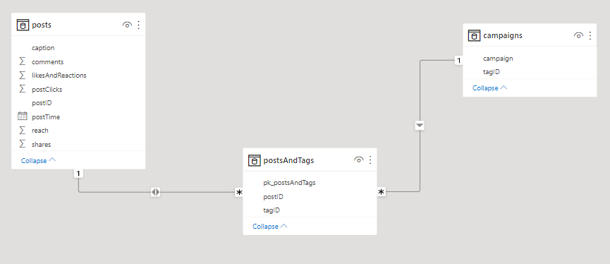
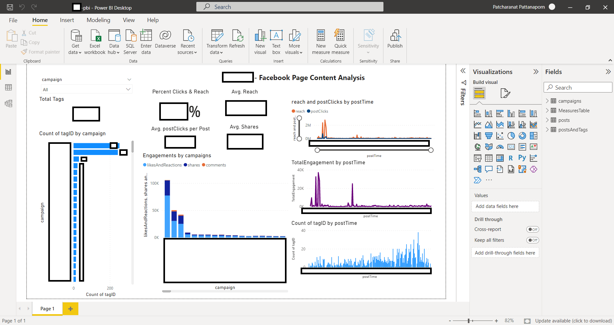
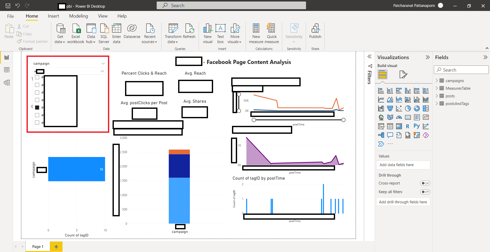

# Marketing Dashboard

*Concept: Integrating Python, SQLite, Power BI to monitor marketing result on an official Facebook page as a dashboard.*

Processes:
* Create a data pipeline transforming .csv to .db
* Database modeling
* Develop dashboard on Power BI Desktop

## What the repository contains:
* Python data pipeline --> [python script: "marketing_dashboard_script.py"](https://github.com/Patcharanat/Marketing-Dashboard/blob/master/marketing_dashboard_script.py)  
**(explanation is contained as comments in the script)**
* SQL script used for creating SQLite database --> ["manage-database.sql"](https://github.com/Patcharanat/Marketing-Dashboard/blob/master/manage-database.sql)
* Pictures file to show in README.md

*P.S. Due to data confidential, dataset, and .pbix file are not available to be shown. Hence, some part of the project will be shown as pictures (with data censored).*

## Data Modeling (Relational Database Relationship)

Data Modeling for filtering content in the dashboard. 
See
* [*Star Schema*](https://learn.microsoft.com/en-us/power-bi/guidance/star-schema)
* [*Bi-directional relationship*](https://learn.microsoft.com/en-us/power-bi/guidance/relationships-bidirectional-filtering) (also, bridging table)
* [*many-to-many relationship*](https://learn.microsoft.com/en-us/power-bi/guidance/relationships-many-to-many#relate-many-to-many-dimensions)

for more understanding of database design.

## Power BI Dashboard

The dashboard can be filtered, then show different contents for a better monitoring. 